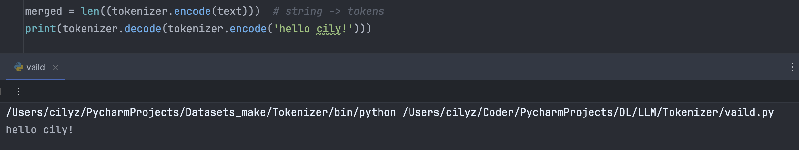
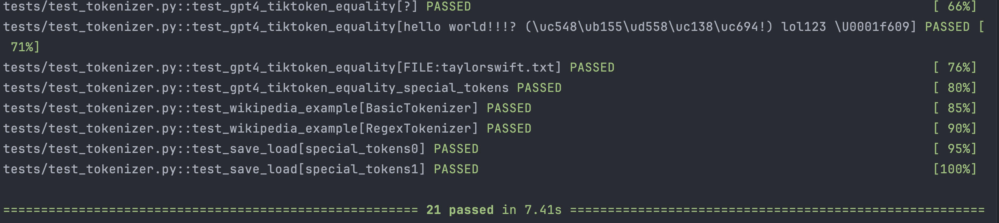
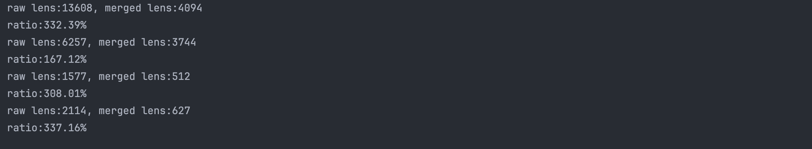

[简体中文](README.zh-CN.md) | English
# Training a Custom Chinese Tokenizer

## Introduction
The Tokenizer is the underlying model of large language models, with its own independent training dataset, playing a crucial role in the impact on large language models. The proportion of various languages in the training dataset of the Tokenizer will affect the merge pairing of the vocabulary, thereby influencing the generalization ability of the large language model in processing various languages. It is very necessary to use a Tokenizer that supports Chinese well for training and fine-tuning models in China.

Here, I used BPE to build a custom Tokenizer model on top of a basic Tokenizer model. The principle is similar to the cl100k_base model of GPT-4.  

  

***

## Getting Started
### Dataset
The dataset format is txt text, you can choose your own (considering the computing power of the device), here I use the Chinese Wikipedia dataset (about 18MB).

### Training
It is recommended to use GPT-4's tokenizer to prevent text, symbols, and numbers from pairing incorrectly during encoding:
```
GPT4_SPLIT_PATTERN = r"""'(?i:[sdmt]|ll|ve|re)|[^\r\n\p{L}\p{N}]?+\p{L}+|\p{N}{1,3}| ?[^\s\p{L}\p{N}]++[\r\n]|\s[\r\n]|\s+(?!\S)|\s+"""
```
I use base+regex, with a vocabulary size of 5K (needs to be set manually, considering the dataset size and device processing capacity, you can try several points for comparison and verification). No special Tokens were added, the running device is a MAC (M1). The training will generate two files, .model and .vocab. Finally, remember to load the .model back into the tokenizer (for more information, please see the reference link):
```
text = open("../dataset.txt", "r", encoding="utf-8").read()
os.makedirs("models", exist_ok=True)
t0 = time.time()
tokenizer = RegexTokenizer()
tokenizer.train(text, 5000, verbose=True)
prefix = os.path.join("models", 'regex5k')
tokenizer.save(prefix)
tokenizer.load('regex5k.model')
t1 = time.time()
print(f"Training took {t1 - t0:.2f} seconds")
```
Training time:

Generated files: [regex5k.model](train/models/regex5k.model) is the token merge pairs generated by BPE based on the input training dataset, [regex5k.vocab](train/models/regex5k.vocab) is the vocabulary.

### Testing
Encode and decode:

Test example passed (relevant libraries are in requirement.txt):

Compression ratio (about 300% for Chinese, about 150% for English):

These parts of the vocabulary are merged multiple times (a characteristic of BPE), indicating that these nouns appeared multiple times in my training dataset:
```
[人民][共和国] -> [人民共和国] 2391
[加拿][大] -> [加拿大] 2438
[行政][区] -> [行政区] 2700
[是][一个] -> [是一个] 2485
[电视][剧] -> [电视剧] 2497
[乌][克兰] -> [乌克兰] 2992
[中国][大陆] -> [中国大陆] 3048
```
## Reference
[karpathy-minbpe](https://github.com/karpathy/minbpe)
