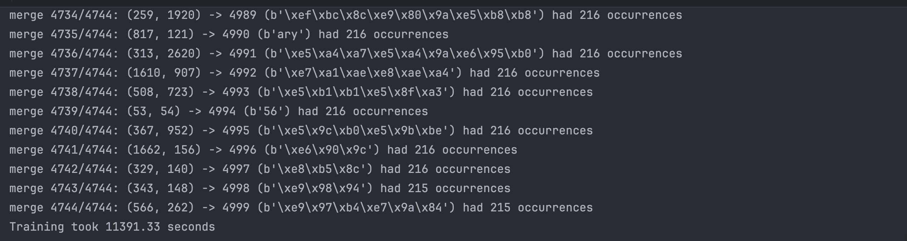
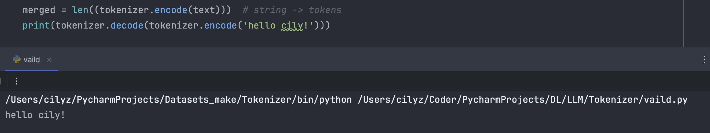
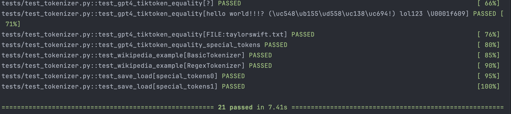
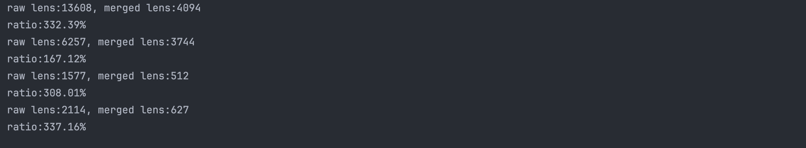

简体中文|[English](README.md)
# 训练定制的中文Tokenizer

## 简介
Tokenizer是大语言模型的底层模型，有着独立的训练数据集，对大语言模型有着重要的影响作用。Tokenizer的训练数据集的各种语言占比会影响到词汇表merge配对，进而影响到大语言模型对各种语言的处理泛化能力。国内的训练微调模型很有必要使用对中文支持良好的Tokenizer。  

这里我使用BPE在基础Tokenizer模型上面构建了专属定制的Tokenizer模型。原理实现和GPT4的cl100k_base模型类似

***

## 开始
### 数据集
数据集格式为txt文本，大家可自行选择（要考虑设备的计算能力），这里我用的是中文维基百科的数据集（18MB左右）

### 训练
推荐使用GPT4的分词器，防止在编码的时候文字，符号，数字凑成一对：
```
GPT4_SPLIT_PATTERN = r"""'(?i:[sdmt]|ll|ve|re)|[^\r\n\p{L}\p{N}]?+\p{L}+|\p{N}{1,3}| ?[^\s\p{L}\p{N}]++[\r\n]*|\s*[\r\n]|\s+(?!\S)|\s+"""
```
我用的base+regex，字汇表大小设的5K（需要手动设置，考虑数据集大小和设备处理能力，可以多尝试几个点，对比验证），没有添加特殊Token，运行设备在MAC（M1），训练结束会生成.model和.vocab两个文件，最后记得把.model载回tokenizer就好了（更多相关信息请看参考链接）：
```
text = open("../dataset.txt", "r", encoding="utf-8").read()
os.makedirs("models", exist_ok=True)
t0 = time.time()
tokenizer = RegexTokenizer()
tokenizer.train(text, 5000, verbose=True)
prefix = os.path.join("models", 'regex5k')
tokenizer.save(prefix)
tokenizer.load('regex5k.model')
t1 = time.time()
print(f"Training took {t1 - t0:.2f} seconds")
```
运行时间：

生成的文件：[regex5k.model](train/models/regex5k.model)是BPE根据输入的训练数据集生成的token合并对,[regex5k.vocab](train/models/regex5k.vocab)词汇表

### 测试
编码再解码：

测试例子通过（相关库在requirement.txt）：

压缩率（中文在300%左右，英文在150%左右）:

看这部分词汇表都是多次merge（也是BPE的一个特点），表示这几个名词在我的训练数据集里出现了多次：
```
[人民][共和国] -> [人民共和国] 2391
[加拿][大] -> [加拿大] 2438
[行政][区] -> [行政区] 2700
[是][一个] -> [是一个] 2485
[电视][剧] -> [电视剧] 2497
[乌][克兰] -> [乌克兰] 2992
[中国][大陆] -> [中国大陆] 3048
```
## 参考链接
[karpathy-minbpe](https://github.com/karpathy/minbpe)


